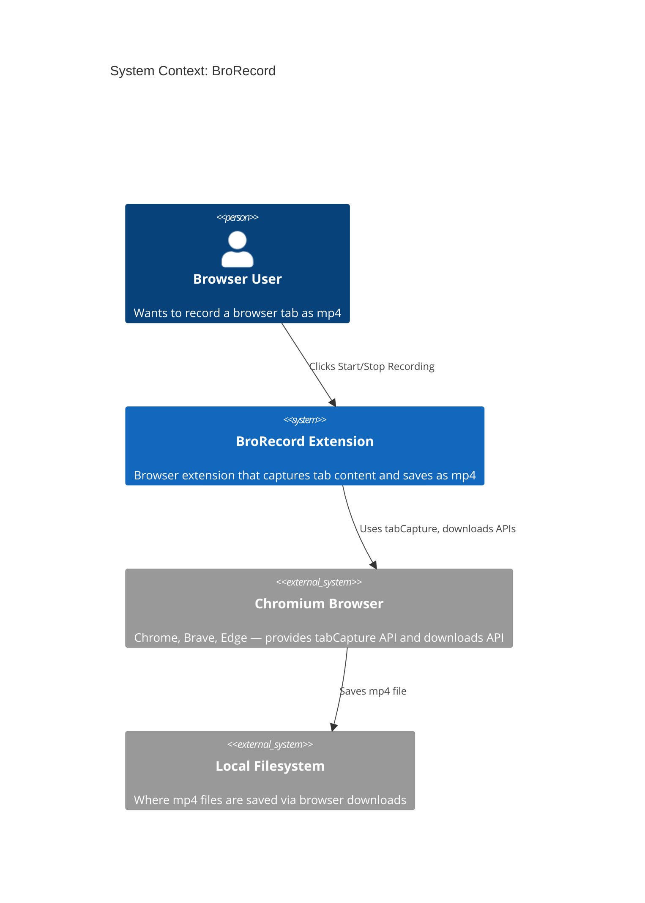
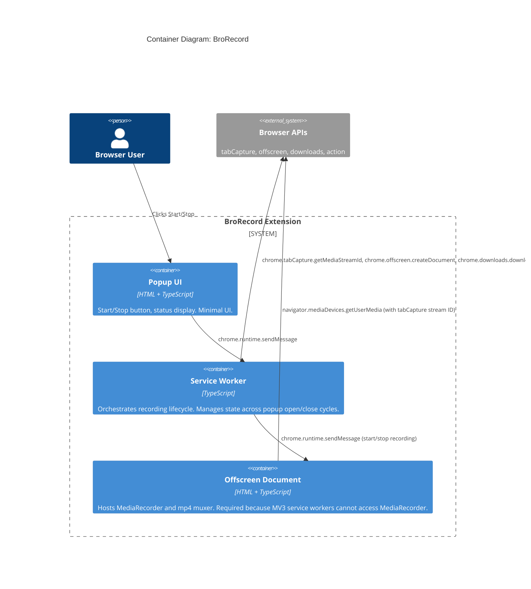

# Architecture Design: BroRecord (browser-tab-recorder)

## Architecture Drivers

| Driver | Priority | Rationale |
|--------|----------|-----------|
| Simplicity | Critical | One-button UX, minimal code surface, no build complexity beyond TypeScript |
| Privacy | Critical | Zero network requests, minimal permissions, all processing local |
| Time-to-market | High | Solo developer, want a working extension quickly |
| Maintainability | Medium | Small codebase, but should be easy to extend (mp4 muxing, Firefox) |
| Performance | Medium | Recording must not degrade tab; mp4 muxing should be fast |

## Architecture Style: Flat Module Composition

This is a small browser extension with ~5 source files. A flat module structure with functional composition is appropriate. No layers, no ports-and-adapters — the extension APIs *are* the boundary.

### Data Flow Pipeline

```
User Click → tabCapture API → MediaStream → MediaRecorder → WebM Blob → mp4 Muxer → Download
```

Each stage is a pure-ish function (some are inherently effectful due to browser APIs). State flows through the pipeline, not stored in mutable globals.

## C4 System Context Diagram



## C4 Container Diagram



## Key Architectural Decision: Offscreen Document for MediaRecorder

In Manifest V3, **service workers cannot access DOM APIs** like `MediaRecorder`. The solution is an **offscreen document** — a hidden page that has DOM access and can run `MediaRecorder` and the mp4 muxer.

**Flow**:
1. Popup sends "start" message to service worker
2. Service worker calls `chrome.tabCapture.getMediaStreamId()` to get a stream ID
3. Service worker creates an offscreen document (if not already open)
4. Service worker sends stream ID to offscreen document
5. Offscreen document calls `navigator.mediaDevices.getUserMedia()` with the stream ID to get a MediaStream
6. Offscreen document creates a `MediaRecorder` on the stream
7. On stop: offscreen document collects chunks → muxes to mp4 → sends blob URL back to service worker
8. Service worker triggers download via `chrome.downloads.download()`

## Component Responsibilities

### Popup (`popup.html` + `popup.ts`)
- Renders Start/Stop button based on current recording state
- Sends `start-recording` / `stop-recording` messages to service worker
- Displays recording duration (optional polish)
- Displays errors/fallback notifications
- **No state ownership** — queries service worker for current state on open

### Service Worker (`background.ts`)
- **State owner**: tracks `{ isRecording: boolean, tabId: number | null }`
- Orchestrates the recording lifecycle
- Manages offscreen document creation/teardown
- Calls `chrome.tabCapture.getMediaStreamId()` for the active tab
- Triggers file download via `chrome.downloads`
- Sets/clears badge on extension icon

### Offscreen Document (`offscreen.html` + `offscreen.ts`)
- Receives stream ID from service worker
- Creates `MediaStream` via `navigator.mediaDevices.getUserMedia()`
- Runs `MediaRecorder` to capture WebM chunks
- On stop: muxes WebM → mp4 using mp4-mux library
- Returns blob URL to service worker
- Implements WebM fallback if muxing fails

## State Management

Minimal state, owned by the service worker:

```typescript
type RecordingState =
  | { status: 'idle' }
  | { status: 'recording'; tabId: number; startTime: number }
  | { status: 'processing' }
```

State transitions:
```
idle → recording (on start-recording message + successful stream capture)
recording → processing (on stop-recording message)
processing → idle (on download triggered or error)
```

## Message Protocol

All communication via `chrome.runtime.sendMessage`:

| Message | From | To | Payload |
|---------|------|----|---------|
| `start-recording` | Popup | Service Worker | `{}` |
| `stop-recording` | Popup | Service Worker | `{}` |
| `get-state` | Popup | Service Worker | `{}` |
| `state-update` | Service Worker | Popup | `RecordingState` |
| `offscreen-start` | Service Worker | Offscreen | `{ streamId: string }` |
| `offscreen-stop` | Service Worker | Offscreen | `{}` |
| `offscreen-result` | Offscreen | Service Worker | `{ blobUrl: string, format: 'mp4' \| 'webm' }` |
| `offscreen-error` | Offscreen | Service Worker | `{ error: string, fallbackBlobUrl?: string }` |

## Error Handling Strategy

| Error | Handler | User Impact |
|-------|---------|-------------|
| Tab capture permission denied | Service worker catches, sends error to popup | Popup shows "Permission needed" with retry |
| Tab closed during recording | Service worker detects tab removal event, signals offscreen to stop | Recording saved with content captured so far |
| MediaRecorder error | Offscreen catches, saves partial WebM | Partial recording downloaded |
| Mp4 mux failure | Offscreen catches, falls back to WebM blob | WebM downloaded, popup shows fallback message |
| Offscreen document crash | Service worker detects disconnect, resets state | Popup shows error, user can retry |
