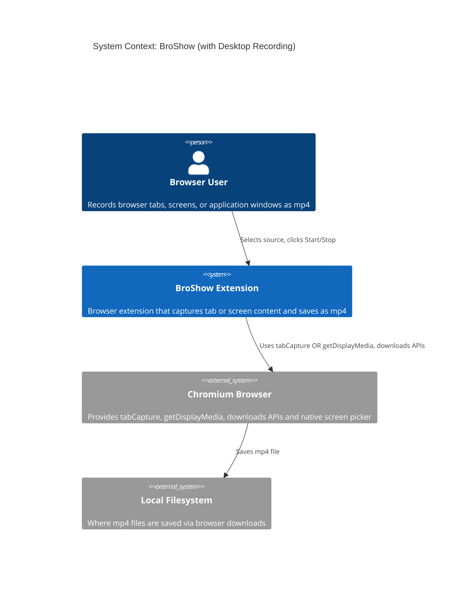
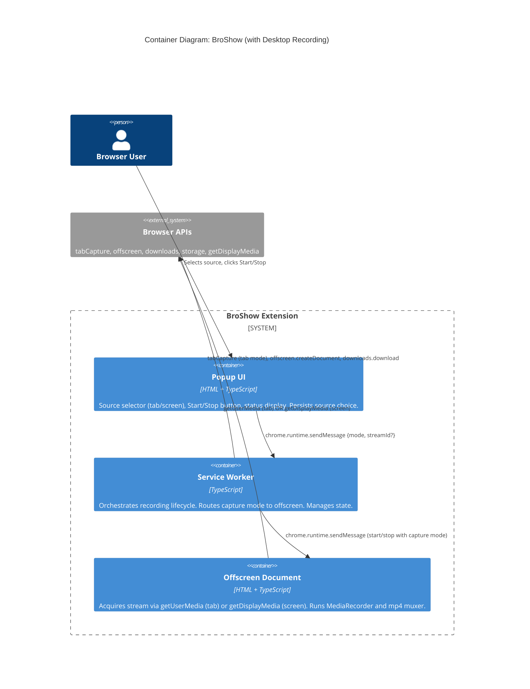

# Architecture Design: desktop-screen-recording

## Architecture Drivers

| Driver | Priority | Rationale |
|--------|----------|-----------|
| Minimal disruption | Critical | Existing tab recording must work identically; changes should be additive |
| Simplicity | Critical | Reuse existing pipeline; one new branch point, not a new architecture |
| Privacy | High | getDisplayMedia shows browser-native picker; no new permissions needed |
| Maintainability | Medium | New capture mode should fit naturally into existing algebraic types |

## Architecture Style: Extended Flat Module Composition

The existing flat module composition with functional core / effect shell is preserved. The desktop-screen-recording feature adds a **single branch point** in the offscreen document: `getUserMedia` (tab) vs `getDisplayMedia` (screen). Everything else — MediaRecorder, mp4 muxing, download — is shared.

### Data Flow: Tab Capture (unchanged)

```
Popup click → start-recording {streamId, mode:'tab'}
  → SW creates offscreen (USER_MEDIA reason)
  → Offscreen: getUserMedia(streamId) → MediaStream
  → MediaRecorder → WebM chunks → mp4 mux → download
```

### Data Flow: Screen/Window Capture (new)

```
Popup click → start-recording {mode:'screen'}
  → SW creates offscreen (DISPLAY_MEDIA reason)
  → Offscreen: getDisplayMedia() → browser picker → MediaStream
  → MediaRecorder → WebM chunks → mp4 mux → download
```

The two paths **diverge only at stream acquisition** and **converge at MediaRecorder**.

## C4 System Context Diagram



## C4 Container Diagram



## Key Architectural Decision: getDisplayMedia in Offscreen Document

### Decision
The offscreen document calls `getDisplayMedia()` when capture mode is `'screen'`.

### Rationale
- `getDisplayMedia()` requires DOM access → service workers can't call it
- `MediaStream` is not serializable → popup can't pass it to offscreen via messages
- Chrome's `offscreen.createDocument()` accepts `DISPLAY_MEDIA` as a reason, explicitly supporting this use case
- The offscreen document already handles stream acquisition for tab capture → natural extension

### Alternatives Considered

| Option | Pros | Cons | Verdict |
|--------|------|------|---------|
| **Offscreen calls getDisplayMedia** | Reuses pipeline, minimal changes, Chrome-supported reason | Offscreen may lack user gesture in some edge cases | **Selected** |
| Popup calls getDisplayMedia | Has user gesture context | MediaStream not serializable; would need to record in popup (loses recording on close) | Rejected |
| New dedicated offscreen for screen | Isolation | Unnecessary complexity; one offscreen can handle both modes | Rejected |

### Risk: User Gesture / Transient Activation

`getDisplayMedia()` typically requires transient activation (user gesture). In Chrome's offscreen context:
- The `DISPLAY_MEDIA` offscreen reason signals to Chrome that this document will call `getDisplayMedia()`
- Chrome may grant the necessary activation when the document is created in response to a user action chain (popup click → SW → offscreen creation)
- If this fails in testing, the fallback is to have the popup call `getDisplayMedia()` and capture in the popup itself (recording lost on popup close — acceptable for short captures, with a warning)

## Activation Risk Mitigation

The `getDisplayMedia()` call requires transient activation. The offscreen document receives activation via the `DISPLAY_MEDIA` reason when created from a user-initiated message chain (popup click → SW → offscreen creation). If this proves insufficient in testing:

1. **First mitigation**: Ensure offscreen creation and `getDisplayMedia()` call happen synchronously on document load (not deferred via message)
2. **Fallback**: If activation never works in offscreen, restructure so popup calls `getDisplayMedia()` and records in-popup (recording lost on popup close — acceptable with a warning for short captures)
3. **Acceptance criteria**: AC-DSR-10 covers this failure path explicitly

This risk must be validated empirically in Slice 1 (walking skeleton) before proceeding to polish stories.

## Offscreen Document Reasons

The offscreen document creation must specify the correct reason based on capture mode:

| Capture Mode | Offscreen Reason | API Used |
|-------------|-----------------|----------|
| `'tab'` | `USER_MEDIA` | `navigator.mediaDevices.getUserMedia()` |
| `'screen'` | `DISPLAY_MEDIA` | `navigator.mediaDevices.getDisplayMedia()` |

## State Management Changes

### RecordingState Extension

The recording state adds a `captureMode` discriminant:

```
idle → recording {tabId?, captureMode, startTime} → processing → idle
```

For screen recording, `tabId` is not meaningful (recording is not tied to a tab). The state becomes:

```typescript
| { status: 'recording'; captureMode: 'tab'; tabId: number; startTime: number }
| { status: 'recording'; captureMode: 'screen'; startTime: number }
```

### Source Selection Persistence

The popup stores the user's source selection in `chrome.storage.local` under key `broshow:capture-mode`. This is read on popup open and written on change. The service worker does not need to read this — it receives the mode via the start message.

## Message Protocol Changes

| Change | Before | After |
|--------|--------|-------|
| `start-recording` | `{ type, streamId }` | `{ type, streamId?, captureMode }` |
| `offscreen-start` | `{ type, streamId }` | `{ type, streamId?, captureMode }` |

All other messages are unchanged. The `streamId` becomes optional — present for tab capture, absent for screen capture.

## Stream Termination Handling

For screen/window capture, the captured source may disappear (window closed, display disconnected). The offscreen document must:

1. Listen for `MediaStreamTrack.onended` events on the acquired stream
2. On unexpected track end (while recording), auto-stop the MediaRecorder
3. Process and save whatever was captured
4. Send `offscreen-result` back to service worker as normal

This mirrors the existing behavior for tab capture when a tab is closed, but the trigger mechanism differs (track ended event vs tab removal event).

## Error Handling Additions

| Error | Handler | User Impact |
|-------|---------|-------------|
| Screen picker cancelled | Offscreen catches `NotAllowedError` from `getDisplayMedia`, sends `offscreen-error` | Popup shows "Permission denied", returns to idle |
| Captured window closed | Offscreen detects track ended, auto-stops MediaRecorder | Recording saved with captured content |
| Display disconnected | Same as window closed (track ended event) | Same recovery |
| getDisplayMedia not supported | Popup checks `navigator.mediaDevices.getDisplayMedia` existence, hides option | Tab-only mode, no error |
| Offscreen lacks activation | `getDisplayMedia` throws `NotAllowedError` | Popup shows error, returns to idle |
