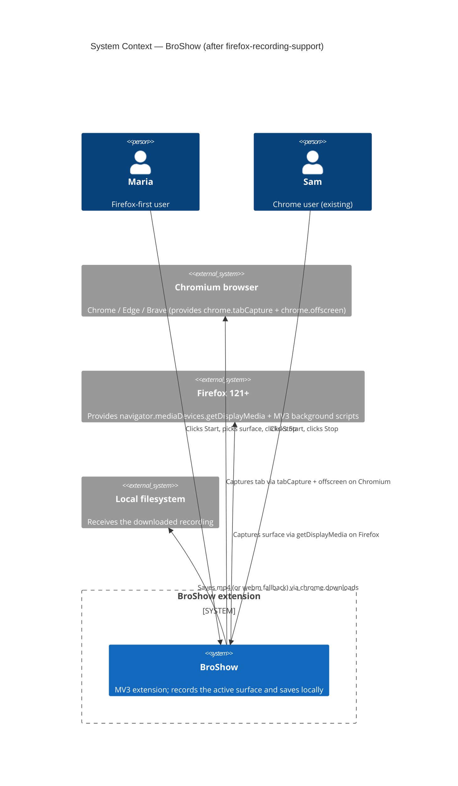
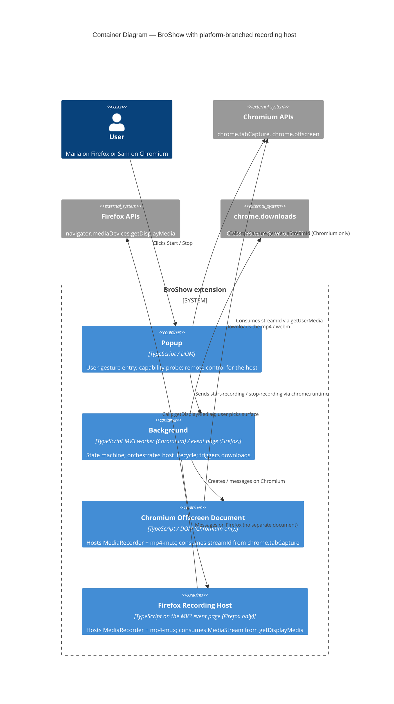

# Architecture Design: firefox-recording-support

> Wave: DESIGN
> Predecessor artifacts: `../discuss/*` (requirements, AC, user-stories, story-map, outcome-kpis, journey-record-tab-firefox.feature, wave-decisions)
> Successor wave: DISTILL (acceptance-designer)
> Paradigm: Functional (per project CLAUDE.md)
> Companion ADR: `docs/adrs/ADR-003-firefox-recording-host.md`

## 1. Problem statement

BroShow ships a working Chrome path (popup -> service worker -> offscreen
document hosting MediaRecorder + mp4-mux -> `chrome.downloads`). On Firefox the
extension installs but the popup's capability probe blocks recording because
`chrome.offscreen` and `chrome.tabCapture` are absent. Firefox does, however,
expose `navigator.mediaDevices.getDisplayMedia` and an MV3 background event
page.

DESIGN must resolve four open questions inherited from DISCUSS:

- DQ-1: Where does the recording host live on Firefox?
- DQ-2: How does the popup pick a path?
- DQ-3: Does ADR-001 need a companion or amendment?
- DQ-4: Does mp4-mux work in the chosen Firefox host?

The user-visible contract (US-FF-03 / AC-FF-03) is the floor: a 5-minute
recording must survive without popup interaction.

## 2. Quality attributes (priority order)

These come from the caller and govern every trade-off below.

| # | Attribute | Source | Rationale |
|---|---|---|---|
| QA-1 | Zero regression on the existing Chrome path | NFR FR-FF-07 | v0.1.2 already ships and is the only working path today. |
| QA-2 | Recording survives popup closing for >= 5 minutes | AC-FF-03 / US-FF-03 | Riskiest assumption in the feature. |
| QA-3 | No new outbound network requests | NFR-FF-03 | Privacy parity with Chrome (NFR-02 in parent). |
| QA-4 | No growth in permissions count | NFR-FF-01, KPI guardrail | Permissions count stays <= 4. |
| QA-5 | Maintainability of a multi-target codebase | Implicit; FP paradigm | Chrome and Firefox paths must coexist without divergent business logic. |

QA-2 dictates host choice. QA-1 dictates additive (not replacement) design.
QA-3 forbids any pattern requiring fetch/XHR. QA-4 forbids the easy
"add `<all_urls>`" escape. QA-5 dictates a `RecorderHost` port with two
adapters rather than a target-branched monolith.

## 3. C4 — System Context



Notes:

- No outbound network systems (NFR-FF-03).
- Both browser engines are external; the extension is the only system we
  build.

## 4. C4 — Container Diagram



Notes:

- The Firefox host is **not** a separate document. It is code that runs inside
  the Firefox MV3 background event page (which is configured by
  `scripts/patch-firefox-manifest.mjs` via `background.scripts`). On Chromium,
  the same `background` container has access to `chrome.offscreen` and
  delegates to a real offscreen document.
- The popup is a **remote control**, not a host, on either platform. Once
  recording starts, it can close without affecting recording.
- `chrome.downloads` exists on both platforms with the same surface (Firefox
  provides `browser.downloads`, polyfilled by `webextension-polyfill` -- see
  technology stack).

## 5. Component decomposition (functional / ports-and-adapters)

C4-L3 not produced as a standalone diagram (the system has < 5 internal
components). The verbal decomposition below is the contract.

### 5.1 Pure core (no DOM, no chrome APIs)

These remain pure functions in the existing `*-logic.ts` files. **No
behavioral change** beyond the additions noted.

- `popup-logic.ts`
  - Existing: `describeUI`, `messageForAction`, `initializePopup`.
  - **Adds**: extended `CapabilityCheckResult` discriminated by `path`
    (`'chromium-offscreen' | 'firefox-display-media' | 'unsupported'`).
  - **Adds**: pure helper `shouldShowFirefoxHint(capability)` returning
    boolean.
- `background-logic.ts`
  - Existing: `formatRecordingFilename`, `badgeFor`, `handleStartRecording`,
    `handleStopRecording`, etc.
  - **No change to state machine.** The state graph
    (`idle -> recording -> processing -> idle`) is identical; what changes
    is which adapter the wiring layer dispatches the lifecycle commands to.
- `offscreen-logic.ts`
  - **No change.** The pure recording handler is already paradigm-correct.
    It is composed with a different adapter set on Firefox (see 5.2.b).

### 5.2 Effect adapters (functions, not classes)

- 5.2.a `ChromiumOffscreenRecorderHost` (existing, unchanged)
  - Lives in `background.ts` (creating/closing the offscreen document) +
    `offscreen.ts` (getUserMedia adapter, storeRecording adapter).
  - Bound to chrome's `tabCapture` + `offscreen` APIs.
- 5.2.b `FirefoxBackgroundRecorderHost` (new)
  - Lives in `background.ts` behind a target check.
  - Implements the same `RecorderHost` port (5.3) but uses
    `navigator.mediaDevices.getDisplayMedia` directly inside the background
    event page; reuses `createOffscreenMessageHandler` from
    `offscreen-logic.ts` with a Firefox-flavored `MediaAPIs` adapter:
    - `getUserMedia(constraints)` -> ignores the chromium-style constraints
      and calls `navigator.mediaDevices.getDisplayMedia({video:true, audio:true})`.
    - `storeRecording(blob)` -> identical (uses `chrome.storage.local`,
      polyfilled).
    - `blobToDataUrl(blob)` -> identical.
    - `sendMessage(msg)` -> uses `chrome.runtime.sendMessage` (polyfilled).
  - This means **the entire mp4-mux + WebM fallback pipeline is reused
    verbatim**. ADR-002 still holds (DQ-4 answered: yes, mp4-mux runs in the
    Firefox background event page; it's a DOM-bearing context).

### 5.3 The platform abstraction

Names are illustrative -- the SHAPE is what matters; software-crafter owns
the final naming.

```text
RecorderHost port (function-shaped, paradigm-aligned):

  startRecording :: (HostInputs) -> Promise<HostStartResult>
  stopRecording  :: () -> Promise<HostStopResult>
  isAlive        :: () -> boolean   (optional; for diagnostics)

HostInputs (algebraic):
  | { target: 'chromium', streamId: string }
  | { target: 'firefox' }   // host invokes getDisplayMedia itself

HostStartResult:
  | { ok: true }
  | { ok: false, cause: 'picker-cancelled' | 'host-error', message: string }

HostStopResult:
  | { ok: true, blob: Blob, format: 'mp4' | 'webm' }
  | { ok: false, cause: 'no-session' | 'mux-error', fallbackBlob?: Blob }

Two adapters implement this port:
  - ChromiumOffscreenRecorderHost  (existing, refactor only to fit port)
  - FirefoxBackgroundRecorderHost  (new)
```

This is **composition, not inheritance**: each adapter is a factory function
returning the port-shaped record. The background wiring layer picks the
adapter by inspecting a single `Target = 'chromium' | 'firefox'` value
derived from the capability probe.

### 5.4 Module dependency rule (the architecture rule we will enforce)

```text
*-logic.ts files MUST NOT import:
  - chrome.* APIs
  - browser.* APIs
  - any DOM type via runtime use (types are ok)
  - any *-host adapter file

Adapter modules (background.ts, offscreen.ts, popup.ts, the new firefox host)
MAY import *-logic.ts and the platform APIs they own.
```

This rule already governs the existing code. Enforcement tooling is named
in section 9.

## 6. Decision rationale — DQ-1 (the recording host)

Three options were enumerated in DISCUSS. Scoring against the priority
attributes:

| Attribute (weight) | A. Popup | B. Record-tab | C. Background event page |
|---|---|---|---|
| QA-1: Zero Chrome regression (highest) | Neutral — popup change is risky if shared with Chrome | Good — purely additive | **Best — symmetrical to Chrome's offscreen, no popup change** |
| QA-2: 5-minute survival w/o popup interaction | **FAIL** — popup closes on blur | Pass — tab persists | Pass — MediaRecorder activity keeps the event page alive |
| QA-3: No outbound network | Pass | Pass | Pass |
| QA-4: No new permissions | Pass | Pass — `chrome.downloads` already declared, no `tabs` permission needed for an extension-owned URL | Pass |
| QA-5: Maintainability of multi-target | Bad — popup carries platform branches | Medium — record-tab is a Firefox-only artifact w/ extra UX | **Best — Firefox event page maps 1:1 to Chrome offscreen, same `MediaAPIs` port reused** |

**Decision: Option C (Firefox MV3 background event page hosts MediaRecorder).**

Tie-break analysis:

- Option A is eliminated by QA-2 (a hard floor from DISCUSS).
- Option B and Option C both satisfy QA-2. Option C wins on QA-5 because it
  reuses `createOffscreenMessageHandler` and the entire `MediaAPIs` port
  with only the `getUserMedia` adapter swapped. Option B introduces a new
  artifact (a tab the user sees) and new failure modes (user closes the
  tab; the tab is not focusable while picking).
- Option C also wins on QA-1 because it confines all Firefox changes to
  modules that do not run on Chrome: a `target === 'firefox'` branch in
  `background.ts` chooses the Firefox host adapter; the Chrome path's
  `chrome.offscreen.createDocument` call is untouched.

### 6.1 Risks for Option C, with mitigations

| Risk | Likelihood | Mitigation |
|---|---|---|
| `getDisplayMedia` user-gesture binding rejects the call when invoked from the background page | Medium | Implementation contract: the popup forwards the click via `chrome.runtime.sendMessage`, the background invokes `getDisplayMedia` immediately on receiving `start-recording`. Firefox honors the runtime-message-as-gesture chain in MV3 today. **Spike obligation:** software-crafter must validate this on Firefox 121 ESR before declaring US-FF-02 done. If the call is rejected with `InvalidStateError` or similar, fall back to architectural Option B (recorded as ADR-003 alternative); kick US-FF-02 back to DISCUSS only if both fail. |
| Background event page is unloaded mid-recording | Low | Active MediaRecorder + active MediaStream tracks keep the page alive across all browsers we target. Defense-in-depth: a no-op `setInterval` heartbeat while recording (10s cadence). The heartbeat is documented in the host adapter, not in the pure core. |
| `chrome.downloads.download(dataUrl, filename)` rejects a very large data URL on Firefox | Low | If observed, swap to `URL.createObjectURL(blob)` for the download href. This is an adapter-internal change; `*-logic.ts` is unaffected. |

### 6.2 What this rules out (negative space)

- **No new permissions.** `getDisplayMedia` requires no host permission;
  `chrome.downloads` is already declared. NFR-FF-01 holds. AC-FF-08 holds.
- **No content scripts.** ADR-001's Option B remains rejected.
- **No record-tab UX.** AC-FF-03's "no popup interaction" is satisfied by
  the event page itself; the user never sees an extra tab.

## 7. Decision — DQ-2 (path selection)

**Decision: Option A (capability probe, single source of truth).**

Replace the existing `CapabilityCheckResult` boolean discriminant with a
discriminated union:

```text
type CapabilityCheckResult =
  | { supported: true,  path: 'chromium-offscreen' }
  | { supported: true,  path: 'firefox-display-media' }
  | { supported: false, reason: string }
```

Probe order (FP, no UA sniffing):

1. If `chrome.offscreen?.createDocument` and `chrome.tabCapture?.getMediaStreamId`
   are both functions -> `chromium-offscreen`.
2. Else if `navigator.mediaDevices?.getDisplayMedia` is a function ->
   `firefox-display-media`.
3. Else -> `unsupported`.

This single value drives:

- The `start-recording` message variant the popup sends.
- The hint visibility (US-FF-04).
- The host adapter the background selects.

DQ-2 alternatives B (UA sniff) and C (build-time flag) rejected: B is an
anti-pattern; C couples runtime behavior to the build pipeline and prevents
a single test matrix from validating both paths.

## 8. Decision — DQ-3 (ADR strategy) and DQ-4 (mp4-mux on Firefox)

- DQ-3: **New ADR (ADR-003-firefox-recording-host.md)** rather than amending
  ADR-001. ADR-001 stays accepted and unchanged; the Firefox decision is
  independently revisable.
- DQ-4: **mp4-mux runs unchanged in the Firefox background event page** (it
  has DOM/Blob/URL access). ADR-002 holds. The WebM fallback path (US-06,
  US-FF-05's second AC) is reused as-is.

## 9. Architecture rule enforcement

The dependency rule from 5.4 is enforceable today with **dependency-cruiser**
(MIT license, active, JS/TS-native). Recommended config (illustrative; full
config is the platform-architect's call in DEVOPS):

```text
forbidden:
  - name: no-chrome-in-pure-logic
    from: { path: '^src/.*-logic\\.ts$' }
    to:   { path: 'chrome|browser|navigator' }   // import-graph based
  - name: no-host-in-pure-logic
    from: { path: '^src/.*-logic\\.ts$' }
    to:   { path: 'host\\.ts$' }
```

This rule is added incrementally; on first introduction it must pass against
the existing codebase (which already obeys it). Documented for handoff to
platform-architect.

## 10. Quality-attribute scenarios (ATAM-style, mini)

| Scenario | Source | Stimulus | Response | Measure |
|---|---|---|---|---|
| QAS-1 (QA-1) | A Chrome user | Installs the new build and records a 30s tab | Recording works identically to v0.1.2 | All AC-FF-06 + parent feature smoke matrix passes |
| QAS-2 (QA-2) | Maria on Firefox | Records 5 minutes without opening the popup | Download arrives with file ~5 minutes long | AC-FF-03 passes; file duration in [4:55, 5:05] |
| QAS-3 (QA-2) | Maria on Firefox | Closes the recorded tab at 0:25 | `track.ended` fires; download arrives with ~25 seconds of content | US-FF-06 + AC-FF-04 |
| QAS-4 (QA-3) | Either user | Performs a complete recording flow | Network panel shows zero outbound requests | AC-FF-09 passes |
| QAS-5 (QA-4) | Build pipeline | Inspects patched manifest after `patch-firefox-manifest.mjs` | Permission count <= 4, equal to Chrome's | AC-FF-08 passes |
| QAS-6 (QA-5) | A maintainer | Adds a new RecorderHost adapter (e.g., Safari hypothetical) | Implements one port; no `*-logic.ts` change required | Smoke: pure logic tests stay green without modification |

## 11. What's deliberately NOT changed

- `popup.html` markup (the hint is added; surrounding markup is not
  redesigned).
- The state machine in `background-logic.ts`.
- The pure offscreen handler in `offscreen-logic.ts`.
- ADR-001 (still Accepted; Chrome path unchanged).
- ADR-002 (still Accepted; mp4-mux applies on Firefox too).
- The permission set in `src/manifest.json`.
- Filename generator (`formatRecordingFilename`).

## 12. External integrations

There are **no external services or APIs**. All processing is in-browser.
No contract tests are recommended for handoff to platform-architect; the
boundaries that matter are the browser-API boundaries, which are covered by
the existing port/adapter split and by manual smoke tests on the matrix in
`outcome-kpis.md`.

## 13. Traceability

| Requirement | Component / decision |
|---|---|
| FR-FF-01 (`getDisplayMedia` path) | 5.2.b FirefoxBackgroundRecorderHost |
| FR-FF-02 (capability-based selection) | 7. DQ-2 decision |
| FR-FF-03 (host lifetime >= 5 min) | 6. DQ-1 Option C |
| FR-FF-04 (`track.ended` parity) | 5.2.b adapter listens for `track.ended` |
| FR-FF-05 (cancel is no-op) | Host returns `picker-cancelled` -> popup back to idle |
| FR-FF-06 (audio-absent note) | Host inspects audio tracks at start; SW broadcasts notice on stop |
| FR-FF-07 (Chrome unchanged) | 11. negative space |
| NFR-FF-01 (permission parity) | 6.2 + 11 |
| NFR-FF-02 (Firefox 121+) | unchanged from `patch-firefox-manifest.mjs` |
| NFR-FF-03 (no network) | 12. external integrations |
| NFR-FF-04 (perf parity) | mp4-mux reused; same code path |

## 14. Open items handed forward

None blocking. Two spike obligations called out for software-crafter:

- S-1: Validate `getDisplayMedia` user-gesture chain from Firefox MV3
  background page on Firefox 121 ESR. If it fails, escalate per 6.1
  Risk row 1.
- S-2: Validate the no-op heartbeat is unnecessary (i.e., active
  MediaRecorder genuinely keeps the event page alive). If it fails, the
  heartbeat moves from "defense in depth" to "required" — same code
  location, no architectural change.
