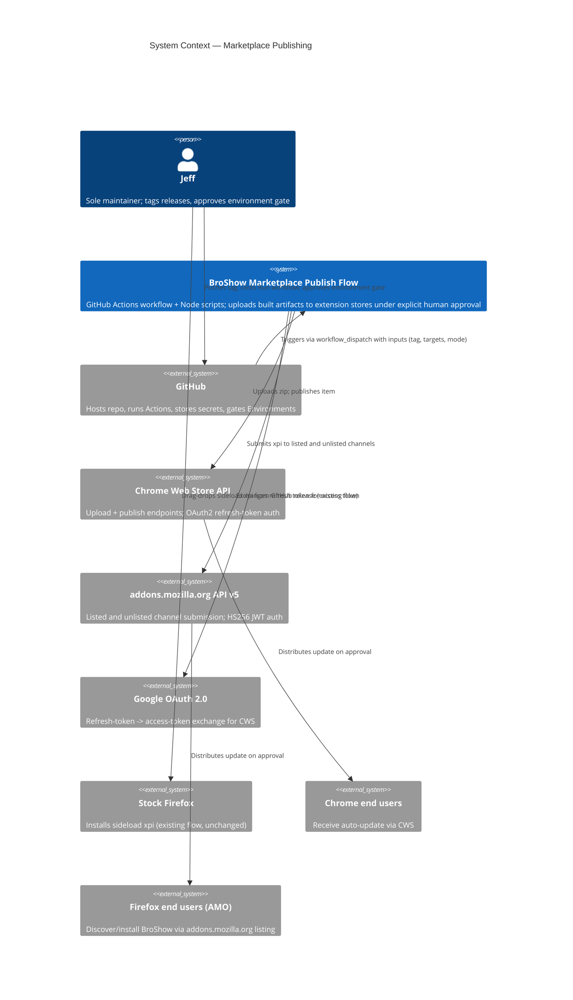
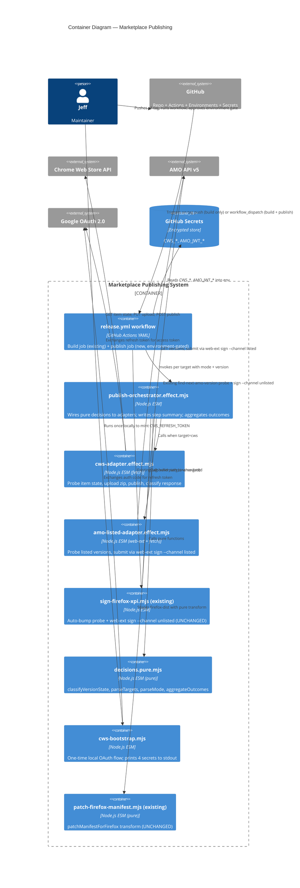

# Architecture Design: Marketplace Publishing

Feature ID: `marketplace-publishing`
Wave: DESIGN
Date: 2026-04-30
Paradigm: **Functional programming** (locked from `CLAUDE.md`)
Style: **Modular ports-and-adapters in functional form** (pure decision core + effectful adapters at module edges)

## 1. Architectural drivers

| Driver | Source | Implication |
|---|---|---|
| Single maintainer, short release cadence | DISCUSS persona | Default monolith CI workflow; no microservice topology |
| Memory rule (no auto-release) | `feedback_no_auto_release.md` | Environment gate at publish boundary; tag push must NOT trigger publish |
| Per-store fail isolation (NFR-3) | `requirements.md` | Parallel jobs with `continue-on-error: true` + aggregation |
| Idempotency (NFR-1) | `requirements.md` | Probe-before-submit pattern; classify as already-published |
| Version conflict fail-hard for listed/CWS (Q4) | `wave-decisions.md` | Pure `classifyVersionState` decision function; no auto-bump path on listed/CWS |
| Functional paradigm | `CLAUDE.md` | Pure transforms for parsing/classification/manifest patching; effects only in adapter modules |
| Dry-run mode (US-5) | `acceptance-criteria.md` AC-5-* | `PublishMode` algebraic type drives a single conditional at the effect boundary; no parallel "fake" code path |
| OSS preference | global rule | All chosen tooling MIT/MPL/Apache; no proprietary additions |

## 2. Architectural style decision

**Default applied: modular monolith, ports-and-adapters in functional style.**

Decomposition criteria:
- Decision logic (what to publish, conflict classification, outcome aggregation) -- pure functions, no I/O dependencies.
- I/O concerns (HTTP to CWS, HTTP to AMO, filesystem, JWT signing, OAuth) -- effectful adapter modules with single-responsibility per external system.
- Orchestration -- a thin shell module that wires pure decisions to effectful adapters and writes the GitHub Actions step summary.

Rejected alternatives:
1. **Single monolithic publish script** (one `publish.mjs` with everything inline). Rejected: untestable -- no seam for unit tests, mutation testing >= 80% impractical, violates `CLAUDE.md` paradigm.
2. **Per-target separate workflows** (`publish-cws.yml` + `publish-amo-listed.yml`). Rejected: maintainer's locked Q3 decision = single environment-gated workflow for unified provenance. Fallback path documented if GitHub Environments unavailable.
3. **Microservices / external orchestrator** (e.g., Argo Workflows). Rejected: 1-person team, 3 publish targets, no operational maturity for that complexity. Resume-driven anti-pattern guard.

Architecture rule enforcement (functional style):
- Module file naming convention encodes effect boundary: `*.pure.mjs` (no I/O imports allowed) and `*.effect.mjs` (effects allowed). A simple grep-based CI check (added in DEVOPS wave) flags `*.pure.mjs` files importing `node:fs`, `node:child_process`, or `fetch`. This is the FP-equivalent of ArchUnit/import-linter for a small Node project.

## 3. C4 System Context (L1)



## 4. C4 Container (L2)



## 5. C4 Component (L3) — publish-orchestrator

The orchestrator is the only container with non-trivial internal structure (5+ collaborators across pure/effect boundary).

```mermaid
C4Component
  title Component Diagram — publish-orchestrator.effect.mjs
  Container_Ext(workflow, "release.yml publish job", "GitHub Actions")
  Container_Ext(cwsAdapter, "cws-adapter.effect.mjs")
  Container_Ext(amoAdapter, "amo-listed-adapter.effect.mjs")
  Container_Ext(stepSummary, "$GITHUB_STEP_SUMMARY", "GitHub Actions output file")

  Component_Boundary(b, "publish-orchestrator.effect.mjs") {
    Component(entry, "main()", "Effect", "Reads env (TAG, TARGETS, MODE); calls pure parsers; dispatches to adapters; writes summary")
    Component(parseInputs, "parseInputs()", "Pure (decisions.pure.mjs)", "Parses TARGETS string -> PublishTarget[]; MODE string -> PublishMode")
    Component(planRun, "planRun()", "Pure (decisions.pure.mjs)", "Given targets + mode, returns ordered list of {target, mode} steps")
    Component(runStep, "runStep()", "Effect", "Calls correct adapter for target; catches throws and converts to PublishOutcome with status='failure'")
    Component(aggregate, "aggregateOutcomes()", "Pure (decisions.pure.mjs)", "PublishOutcome[] -> AggregateResult; computes overall exit code")
    Component(renderSummary, "renderSummary()", "Pure (decisions.pure.mjs)", "AggregateResult -> Markdown string for $GITHUB_STEP_SUMMARY")
    Component(writeSummary, "writeSummary()", "Effect", "Appends rendered Markdown to $GITHUB_STEP_SUMMARY file")
  }

  Rel(workflow, entry, "Invokes via node publish-orchestrator.effect.mjs")
  Rel(entry, parseInputs, "Parses workflow inputs")
  Rel(entry, planRun, "Plans steps")
  Rel(entry, runStep, "Executes each step in parallel")
  Rel(runStep, cwsAdapter, "Delegates when target=cws")
  Rel(runStep, amoAdapter, "Delegates when target=amo-listed")
  Rel(entry, aggregate, "Combines outcomes")
  Rel(entry, renderSummary, "Renders Markdown summary")
  Rel(entry, writeSummary, "Writes summary to file")
  Rel(writeSummary, stepSummary, "Appends Markdown")
```

## 6. Driving and driven ports (FP form)

In functional ports-and-adapters, ports are **function signatures**. Adapters are modules that export functions matching those signatures. The pure core depends only on signatures (it never imports an adapter directly). The orchestrator (impure shell) imports both pure decisions and concrete adapters.

### Driving ports (inbound; trigger the system)

| Port | Signature | Adapter |
|---|---|---|
| `runPublishWorkflow` | `(env: ProcessEnv) => Promise<ExitCode>` | `release.yml` publish job invokes `node publish-orchestrator.effect.mjs`; the orchestrator's `main()` is the adapter |
| `runDryRun` | Same shape, `mode='dry-run'` in env | Same orchestrator, branch on `PublishMode` |
| `runBootstrap` | `(env: ProcessEnv) => Promise<ExitCode>` | Local CLI invocation of `cws-bootstrap.mjs` |

### Driven ports (outbound; system calls externals)

Each port is a function signature in `ports.pure.mjs` (type docs only; runtime is duck-typed since this is JS). Adapters in `*-adapter.effect.mjs` files implement them.

| Port | Signature | Adapter (production) | Adapter (test) |
|---|---|---|---|
| `probeCwsItemState` | `(creds: CwsCreds, itemId: string) => Promise<CwsItemState>` | `cws-adapter.effect.mjs` (real fetch) | in-memory stub returning fixture |
| `uploadCwsItem` | `(creds: CwsCreds, itemId: string, zipPath: string) => Promise<UploadResult>` | `cws-adapter.effect.mjs` | fixture |
| `publishCwsItem` | `(creds: CwsCreds, itemId: string, target: CwsPublishTarget) => Promise<PublishResult>` | `cws-adapter.effect.mjs` | fixture |
| `exchangeCwsRefreshToken` | `(creds: CwsCreds) => Promise<AccessToken>` | `cws-adapter.effect.mjs` (Google OAuth) | fixture |
| `probeAmoListedVersions` | `(jwt: AmoJwtCreds, addonGuid: string) => Promise<Set<string>>` | `amo-listed-adapter.effect.mjs` | fixture |
| `submitAmoListed` | `(jwt: AmoJwtCreds, xpiPath: string, version: string) => Promise<AmoSubmitResult>` | `amo-listed-adapter.effect.mjs` (wraps `web-ext sign --channel listed`) | fixture |
| `probeAmoUnlistedVersions` | `(jwt: AmoJwtCreds, addonGuid: string) => Promise<Set<string>>` | existing `find-next-amo-version.mjs` reused | -- |
| `signAmoUnlisted` | (existing) | existing `sign-firefox-xpi.mjs` reused | -- |
| `readManifestVersion` | `(manifestPath: string) => Promise<string>` | `fs-adapter.effect.mjs` thin wrapper around `readFile` | fixture |
| `writeStepSummary` | `(markdown: string) => Promise<void>` | `fs-adapter.effect.mjs` (appends to `$GITHUB_STEP_SUMMARY`) | no-op stub |

### Pure core (depends on no port adapters; only on signatures via duck typing)

| Pure module | Functions |
|---|---|
| `decisions.pure.mjs` | `parseTargets`, `parseMode`, `classifyVersionState`, `planRun`, `aggregateOutcomes`, `renderSummary` |
| `manifest.pure.mjs` | (existing `patch-firefox-manifest.mjs` with `patchManifestForFirefox`) |
| `version.pure.mjs` | (existing semver/bump helpers extracted from `find-next-amo-version.mjs` if needed) |

## 7. Quality attribute strategies

| ISO 25010 Attribute | Strategy | Verifiable by |
|---|---|---|
| Reliability / Fault tolerance (NFR-3) | Per-target steps run with `continue-on-error: true`; orchestrator aggregates and exits non-zero only at end | UAT scenario US-3 #5 (one fails, other completes) |
| Reliability / Recoverability (NFR-6) | `targets` workflow input + per-store probe-before-submit; `aggregateOutcomes` emits explicit copy-paste recovery hint | UAT US-4 #1, AC-4-4 |
| Maintainability / Testability | Pure-vs-effect file naming convention; pure decisions unit-testable with no I/O; adapters mocked at port boundary | Mutation testing >= 80% on `*.pure.mjs` files |
| Security / Confidentiality (NFR-4) | Secrets only via env vars; orchestrator never logs raw env values; `::add-mask::` for any derived access token; no secret written to disk by bootstrap | AC-X-1 grep, AC-1-2 |
| Performance / Time behavior (NFR-5) | Adapters invoked in parallel via `Promise.all` inside orchestrator OR (preferred) parallel matrix jobs in YAML; either way, no sequential coupling | AC-X-4 wall-clock |
| Functional Suitability / Correctness | Probe-before-submit ensures idempotency in all cases (re-run is safe) | AC-3-8, AC-4-2, AC-4-3 |
| Operability / Observability (NFR-2) | Each adapter returns structured `PublishOutcome`; `renderSummary` emits Markdown with marketplace, version, outcome, classification, dashboard URL | AC-3-5, AC-3-10 |
| Compliance with maintainer rule (NFR-7) | Workflow YAML triggers: build runs on `push tags`, publish job runs only on `workflow_dispatch` AND requires environment approval | AC-3-1, AC-3-2, AC-X-5 |

## 8. Trigger model and environment gate (Q3 implementation)

Primary path (locked Q3 = Option C):

1. `release.yml` keeps existing `on: push tags v*` build behavior (unchanged from baseline). Build job uploads artifacts to GitHub Release.
2. `release.yml` adds `workflow_dispatch` trigger with inputs: `tag`, `targets`, `cws_publish`, `dry_run`.
3. Build job runs unconditionally on both triggers.
4. New `publish` job: `needs: build`, `if: github.event_name == 'workflow_dispatch'`, `environment: marketplace-prod`.
5. `marketplace-prod` environment configured (one-time) with required reviewer = repo owner. Approval click is the explicit go-ahead.
6. Publish job downloads built artifacts from the build job (no rebuild), invokes orchestrator with workflow inputs.

Fallback path (if GitHub Environments unavailable on this repo's plan):

1. Keep `release.yml` unchanged for build (existing behavior).
2. Add separate `publish-stores.yml`, trigger only on `workflow_dispatch`, no environment gate, but require maintainer to type the tag string into the dispatch UI (the dispatch click itself is the explicit go-ahead).
3. Architecture is identical otherwise -- same orchestrator, same adapters.

DEVOPS wave decides which path applies after probing repo plan capabilities. Both are fully designed.

## 9. Failure isolation and aggregation

### Per-step semantics

Each adapter MUST return a `PublishOutcome` (see `data-models.md`) and MUST NOT throw uncaught for known failure modes. The orchestrator wraps the adapter call in a try/catch as a safety net for unexpected throws (network, etc.), converting any throw into `PublishOutcome { status: 'failure', message: error.message }`.

### Aggregation rules

`aggregateOutcomes(outcomes: PublishOutcome[]) => AggregateResult`:
- `exitCode = outcomes.some(o => o.status === 'failure') ? 1 : 0`.
- `exitCode = 1` also if all targets resolved to `already-published` AND `mode !== 'dry-run'` (re-dispatch on already-shipped is non-actionable; clear "nothing to do" non-zero is preferable to silent zero exit).
- `exitCode = 0` for dry-run when all probes succeeded and no version conflict detected.

### Step summary contract (`renderSummary`)

Markdown table to `$GITHUB_STEP_SUMMARY`:
```
| Target | Version | Status | Message | Dashboard |
|--------|---------|--------|---------|-----------|
| cws | 0.3.0 | success | Submitted for review | https://chrome.google.com/webstore/detail/abc... |
| amo-listed | 0.3.0 | failure | HTTP 401: refresh token expired | https://addons.mozilla.org/.../broshow |
```
Plus a **Recovery** section emitted only when at least one outcome is `failure`:
```
## Recovery

Re-dispatch this workflow with:

  targets: amo-listed
  cws_publish: default
  dry_run: false

After regenerating credentials. See: docs/release.md#recovery
```

## 10. External integration annotations (for DEVOPS handoff)

External integrations requiring contract testing:
- **Chrome Web Store API v1.1** (REST): consumer = `cws-adapter.effect.mjs`. Endpoints: `PUT /chromewebstore/v1.1/items/{id}`, `POST /chromewebstore/v1.1/items/{id}/publish`, `GET /chromewebstore/v1.1/items/{id}?projection=DRAFT`. **Recommended: Pact-JS consumer-driven contract** with golden response fixtures captured from a real CWS test item; replayed in CI to detect breaking changes before they hit production. Contract test execution belongs in CI acceptance stage (DEVOPS).
- **Google OAuth 2.0 token endpoint** (REST): consumer = `cws-adapter.effect.mjs`. Endpoint: `POST https://oauth2.googleapis.com/token`. Stable, RFC 6749. **Lower contract-test priority** (well-specified standard, rare breakage). Snapshot-test the request body shape only.
- **AMO API v5** (REST): consumer = `amo-listed-adapter.effect.mjs` and existing `find-next-amo-version.mjs`. Endpoints: `GET /api/v5/addons/addon/{guid}/versions/`, plus the upload-and-version endpoints invoked transitively by `web-ext sign`. **Recommended: Pact-JS** for the GET probe (deterministic). The `web-ext sign` interaction is a thicker integration test; mock at the `web-ext` invocation boundary using fixtures.

## 11. ADRs produced

- `docs/adrs/ADR-004-marketplace-publish-architectural-style.md` — modular ports-and-adapters in functional style
- `docs/adrs/ADR-005-cws-adapter-direct-fetch-vs-library.md` — direct `fetch` over `chrome-webstore-upload` library
- `docs/adrs/ADR-006-amo-listed-via-web-ext-sign.md` — reuse `web-ext sign --channel listed`, not direct API
- `docs/adrs/ADR-007-publish-trigger-environment-gate.md` — environment-gated job in `release.yml` (with documented fallback)
- `docs/adrs/ADR-008-version-conflict-policy.md` — fail-hard for listed/CWS, keep auto-bump for AMO unlisted only
- `docs/adrs/ADR-009-pure-vs-effect-file-naming-enforcement.md` — `*.pure.mjs` / `*.effect.mjs` convention as architecture-rule enforcement

## 12. Top-level component list

| # | Component | File path | Pure? | Status |
|---|---|---|---|---|
| 1 | release.yml workflow | `.github/workflows/release.yml` | -- (YAML) | Extend existing |
| 2 | publish orchestrator | `scripts/publish-orchestrator.effect.mjs` | No | New |
| 3 | CWS adapter | `scripts/cws-adapter.effect.mjs` | No | New |
| 4 | AMO listed adapter | `scripts/amo-listed-adapter.effect.mjs` | No | New |
| 5 | Decisions module | `scripts/decisions.pure.mjs` | Yes | New |
| 6 | CWS bootstrap CLI | `scripts/cws-bootstrap.mjs` | No (local CLI) | New |
| 7 | FS adapter | `scripts/fs-adapter.effect.mjs` | No | New (thin wrapper for testability) |
| 8 | AMO unlisted sign | `scripts/sign-firefox-xpi.mjs` | No | Reuse unchanged |
| 9 | AMO unlisted probe | `scripts/find-next-amo-version.mjs` | No | Reuse unchanged (unlisted only) |
| 10 | Firefox manifest patch | `scripts/patch-firefox-manifest.mjs` | Yes | Reuse unchanged |
| 11 | Permission strip | `scripts/strip-chrome-only-permissions.mjs` | Yes | Reuse unchanged |

## 13. Quality gates

- [x] Requirements traced to components: each FR-N maps to one or more components in section 12.
- [x] Component boundaries with clear responsibilities (section 12).
- [x] Technology choices in ADRs with alternatives (ADR-004 through ADR-009).
- [x] Quality attributes addressed (section 7).
- [x] Dependency-inversion compliance: pure core depends on signatures, never on adapters (section 6).
- [x] C4 diagrams (L1 + L2 + L3 for orchestrator) in Mermaid.
- [x] Integration patterns specified (section 10).
- [x] OSS preference validated: all dependencies (`web-ext`, no library for CWS, native `fetch`) are MIT/MPL/Apache.
- [x] AC behavioral, not implementation-coupled (verified against `acceptance-criteria.md`).
- [x] External integrations annotated with contract test recommendation (section 10).
- [x] Architectural enforcement tooling recommended (section 2: `*.pure.mjs` / `*.effect.mjs` grep CI check, ADR-009).

## 14. Open architectural questions (low priority; resolvable in DEVOPS)

1. **GitHub Environments availability**: To be probed in DEVOPS. Both primary and fallback trigger models are fully designed (section 8).
2. **AMO listing first-time metadata** (description, screenshots): Out of scope for v1 per `wave-decisions.md`. Maintainer creates listing manually before first listed publish; DEVOPS documents the prerequisite.
3. **Pact broker hosting**: Whether to run a self-hosted Pact broker or use file-based contract sharing. Low priority; DEVOPS decision.
