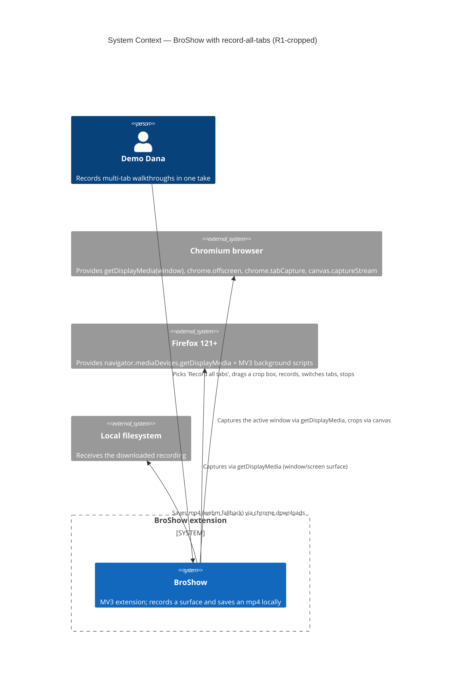
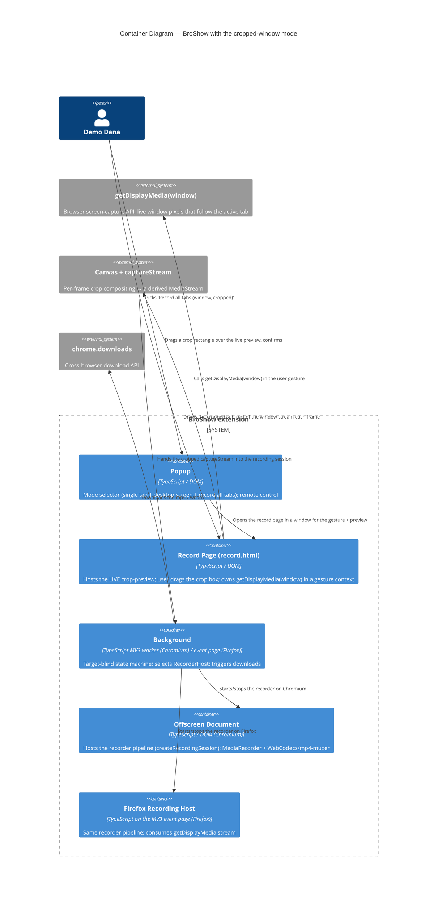
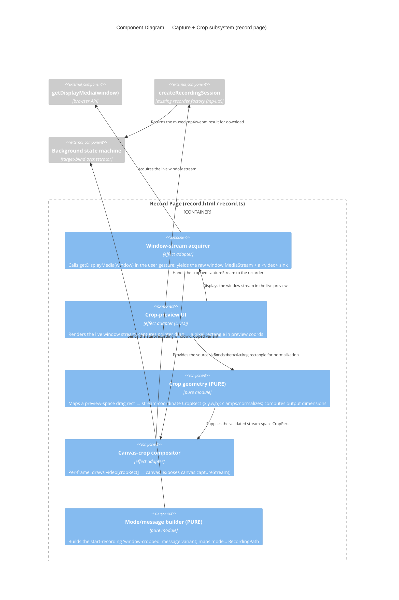

# Architecture Design: record-all-tabs (R1-cropped)

> Wave: DESIGN (Morgan / nw-solution-architect)
> Predecessor artifacts: `../feature-delta.md` (DISCUSS + SPIKE back-propagation),
>   `../spike/{findings,wave-decisions,upstream-issues}.md`, `../slices/slice-0{0,1,2}.md`
> Successor wave: DISTILL (acceptance-designer), then DEVOPS (platform-architect)
> Paradigm: Functional (per project CLAUDE.md) — pure core / effect shell,
>   algebraic types, composition pipelines, effect boundaries as function signatures.
> Companion ADRs: `docs/adrs/ADR-010..ADR-013` (see §12).

## 1. Problem statement (business value, tied to JTBD)

**JTBD `capture-multi-tab-workflow`** (Demo Dana): *"When I record a workflow that
moves across several tabs, I want the recording to follow whichever tab I'm
looking at, so I get one continuous video without stopping, restarting, and
stitching."*

The DISCUSS framing (D1: tab-scoped capture that auto-follows the active tab)
was **proven infeasible** by the slice-00 SPIKE: no Chromium primitive delivers
*tab-scoped + auto-follow + single file* together. `tabCapture` follow is
gesture-blocked from `tabs.onActivated`; `getDisplayMedia` tab-surface pins to
one chosen tab; window-surface follows but includes the browser chrome.

The user reframed to **R1-cropped (D1′, locked 2026-06-06)**:

> "Record all tabs" = capture the active browser **window** via
> `getDisplayMedia({video:{displaySurface:'window'}})`, **canvas-cropped** to a
> one-time **user-drawn region**. The window stream inherently follows the active
> tab; cropping hides the tab strip / toolbar / other windows.

This delivers the *functional* job (one gap-free mp4 that follows the active
tab) and most of the *emotional/social* job (polished, no stitching). Continuity
becomes **trivial** — a single uninterrupted window stream has no seam — so the
original AC2.2 "seam threshold" risk disappears entirely.

**Accepted caveat (user decision "R1-cropped is enough"):** switching to a
sensitive tab still records that tab's *content*; cropping only hides chrome. No
pause/exclude in v1. This is a residual privacy caveat carried to DISTILL, not a
design defect.

DESIGN must resolve five open questions inherited from the SPIKE pivot:

- DQ-1: How does the user-drawn crop region reach the compositing stage?
- DQ-2: Where does the canvas-crop compositing function sit relative to the
  existing `createRecordingSession` / offscreen pipeline?
- DQ-3: Which context owns `getDisplayMedia({displaySurface:'window'})` (gesture
  requirement), and does this disturb the single-`streamId` offscreen contract?
- DQ-4: Does the new mode need a new `RecorderHost` method/variant, or does it
  slot in as a new `RecordingPath` consumed by the existing host?
- DQ-5: How does Firefox map with minimal/no extra branching?

## 2. Quality attributes (priority order)

These govern every trade-off below.

| # | Attribute | Source | Rationale |
|---|---|---|---|
| QA-1 | Zero regression on the two shipped modes (single-tab Chromium, Firefox display-media) | DoD #2, AC1.1 "byte-for-byte" | Default behavior must be provably unchanged. The new mode is **additive**. |
| QA-2 | Crop fidelity — the output shows ONLY the user-drawn region, no chrome | slice-01 AC-crop | The whole point of R1-cropped; the privacy/polish promise rests here. |
| QA-3 | Continuity across tab switches with no gap | US-2 AC2.1 (generalized) | Now *inherent* to one window stream — design must not reintroduce a seam. |
| QA-4 | Testability without a live browser-driven extension | SPIKE constraint (Chrome 148 blocks CLI/CDP) | Pure seams (crop math, mode mapping, message building) must be unit+mutation testable headlessly. |
| QA-5 | Maintainability of the target-blind port | Project invariant: `selectHost` is the SINGLE platform branch | The new mode must not add a second platform branch. |
| QA-6 | No new permissions, no outbound network | Vision (local-first/private), parity with prior features | `getDisplayMedia` needs no host permission; `chrome.downloads` already declared. |

QA-1 dictates additive types and a new mode discriminant (never overloading the
existing single-tab path). QA-2 + QA-3 dictate where the canvas-crop stage sits.
QA-5 dictates reusing the existing `RecorderHost` port unchanged (DQ-4).

## 3. C4 — System Context (L1, MANDATORY)



Notes:

- **No outbound network systems.** All capture, cropping, and muxing happen
  in-browser (QA-6). No external services → **no contract tests** recommended for
  the DEVOPS handoff (see §13).
- Both browser engines are external; the extension is the only system we build.
- The "window stream" the browser hands us is the source of truth for what is on
  screen; the crop rectangle is BroShow's own model layered on top.

## 4. C4 — Container Diagram (L2, MANDATORY)



Notes:

- The **record page** (`record.html` / `record.ts`, already shipped as the
  Firefox recorder surface) is reused as the **gesture + live-preview owner** for
  this mode. `getDisplayMedia` must be called from a page with a user gesture and
  full `Window` privileges — the popup origin cannot call it (proven by the
  Firefox feature). The record page already satisfies both. See ADR-011.
- The **canvas-crop stage** is the only net-new pixel-path component. It sits
  **between** the window stream and the existing recorder session: it consumes
  the raw window `MediaStream`, draws the cropped sub-rect each frame onto a
  `<canvas>`, and exposes `canvas.captureStream()` as the stream the recorder
  consumes. The recorder pipeline (`createRecordingSession`) is **unchanged** —
  it sees an ordinary `MediaStream`. See ADR-013.
- The popup remains a **remote control / launcher**. It does not host capture.

## 5. C4 — Component Diagram (L3, capture+crop subsystem)

This subsystem has ≥5 collaborating parts and is the novel/risky core, so an L3
diagram is warranted (per the C4 rule: L3 only for complex subsystems).



Notes:

- **Pure seams** (testable without a browser, QA-4): `cropmath` (drag-rect →
  `CropRect`, clamping, output sizing) and `modemsg` (mode → `RecordingPath`,
  message construction). These are where unit + mutation coverage lands.
- **Effect seams** (browser-bound): `acq`, `preview`, `compositor`. These are
  validated by the headed E2E harness or human gate (QA-4, §11).
- The compositor is "pure-ish": its per-frame transform (`drawImage` of a
  sub-rect) is a deterministic function of `(sourceFrame, CropRect)`; only the
  `requestAnimationFrame` loop and the canvas handle are effects. The **geometry**
  is extracted into `cropmath` so the math is unit-tested in isolation.

## 6. Decision — DQ-1: how the crop region reaches the compositor

**Decision: LIVE PREVIEW in the record page (Decision A, locked).**

The record page renders the captured window stream in a `<video>` element and
overlays a draggable selection box. On confirm, the drag rectangle (in preview
CSS-pixel coords) is converted by the **pure** `cropmath` module into a
stream-coordinate `CropRect {x,y,w,h}` using the video's intrinsic dimensions vs.
its rendered size. The `CropRect` is then handed directly to the compositor in
the **same page** — it never crosses a message boundary, because the page that
draws the preview is the page that owns the stream and runs the compositor.

Why not chrome-height estimation: the SPIKE explicitly rejected it as the
"fragile chrome-height-estimation problem." A user-drawn rect over a live
preview is WYSIWYG and removes that fragility (QA-2). Alternatives considered and
rejected are recorded in ADR-011.

## 7. Decision — DQ-2/DQ-3: compositor placement and stream ownership

**Decision: the canvas-crop compositor is a transform stage INSIDE the record
page, upstream of the unchanged `createRecordingSession`.**

Pipeline (composition, left-to-right):

```text
getDisplayMedia(window)  →  <video> sink  →  [PURE CropRect from cropmath]
   →  canvas.drawImage(video, sx,sy,sw,sh → 0,0,dw,dh) per frame
   →  canvas.captureStream(fps)  →  createRecordingSession(stream)  →  mp4/webm
```

- **Ownership of `getDisplayMedia`:** the **record page** (gesture context, full
  `Window`). This mirrors the shipped Firefox path exactly, so it adds no new
  gesture-context risk. The service worker never mints the stream (it can't —
  same constraint that killed tabCapture-follow).
- **The single-`streamId` offscreen contract is NOT disturbed for this mode.**
  On the cropped-window mode the *recorder runs in the record page itself* (as
  the Firefox path already does via `createMediaRecorderSession`), so the
  Chromium offscreen `streamId`-in-URL handshake is bypassed for this mode only.
  The existing single-tab Chromium mode keeps its offscreen `streamId` contract
  byte-for-byte (QA-1). This is the cleanest way to keep continuity trivial: the
  cropped stream is a local `MediaStream` that cannot be serialized through a
  `streamId`, so it must be consumed in the page that produced it.
- **Continuity (QA-3) is inherent.** There is exactly one uninterrupted window
  stream for the whole session. A tab switch changes the *pixels inside* that
  stream, not the stream identity — the compositor and recorder never restart,
  so there is no seam. The design must simply **never** tear down and re-acquire
  on `tabs.onActivated` (and indeed there is no activation handler at all in this
  mode — see §11 negative space).

## 8. Decision — DQ-4: RecorderHost port impact

**Decision: NO new `RecorderHost` method or variant. The cropped-window mode
slots in as a new `RecordingPath` that resolves to a record-page-hosted recorder
session — the same shape the Firefox path already uses.**

Rationale (QA-5 — preserve the target-blind port and the single platform branch):

- The `RecorderHost` port (`start`/`stop`, `HostStartInput`/`HostStopResult`) is
  **about target** (chromium vs firefox), not about **mode** (single-tab vs
  cropped-window). Mode is a property of *which surface and pipeline* the page
  feeds the recorder, decided in the record page, not a target distinction.
- The recorder the record page uses is `createRecordingSession` (Chromium, full
  WebCodecs/mp4 pipeline) or `createMediaRecorderSession` (the existing
  record-page choice). The compositor hands it an ordinary `MediaStream`; the
  recorder is **target-blind and mode-blind**.
- Therefore the new mode adds a `RecordingPath` discriminant
  (`'window-cropped'`) at the *message/orchestration* layer and a record-page
  branch on **mode**, but introduces **zero** new `target ===` branch.
  `selectHost` / `targetForPath` (the SINGLE platform branch, recorder-host.ts)
  is **untouched**. See ADR-012 and `data-models.md §5`.

This is the load-bearing maintainability decision: *mode is orthogonal to
target.* Folding the cropped-window mode into the host port would create a
mode×target matrix; keeping it at the path/record-page layer keeps the port a
pure target abstraction.

## 9. Decision — DQ-5: Firefox mapping

**Decision: Firefox needs essentially no extra branching — it already uses
`getDisplayMedia` in the record page.**

The shipped Firefox path *is* a record-page-hosted `getDisplayMedia` recorder
(`record.ts` → `createMediaRecorderSession`). The cropped-window mode is the same
shape with two deltas, both **mode** deltas (not target deltas):

1. Constrain the request to `{video:{displaySurface:'window'}}` for this mode
   (Firefox honors `displaySurface` as a picker hint; if the user picks a
   different surface, the crop still applies to whatever stream is granted).
2. Insert the canvas-crop compositor between the granted stream and
   `createMediaRecorderSession`.

Because the compositor and crop UI live in the record page — which both targets
already use as the recorder surface on the display-media path — the **same code
serves both targets**. Chromium gains the record-page recorder for *this mode
only* (its single-tab mode keeps offscreen). No second platform branch is added
(QA-5). See ADR-013 §consequences.

## 10. Decision — DQ-2 audio (Decision B): include if shared

**Decision: include audio if the `getDisplayMedia` grant provides a track; else
video-only. No new audio infrastructure.**

The compositor crops **video** only. The granted stream's audio track (if any)
is passed through unchanged into the recorder session alongside the cropped video
track — exactly the `record.ts` pattern today (it already composes
`[...displayVideoTracks, ...audioTracks]`). `createRecordingSession` already
muxes audio when present (`mp4.ts` adds an `AudioEncoder` only if an audio track
exists). So "include if shared" is the *existing* behavior with the video track
swapped for the cropped one. No new audio path. See `data-models.md §4`.

## 11. Quality-attribute scenarios (ATAM-style, mini) + testability

| Scenario | QA | Stimulus | Response | Measure |
|---|---|---|---|---|
| QAS-1 | QA-1 | Chrome user records a single tab (existing mode) | Identical to today; offscreen + streamId path untouched | Existing single-tab smoke + unit suite stays green |
| QAS-2 | QA-2 | Dana drags a crop box over the content area, records | Output shows only the region; no tab strip/toolbar | slice-01 AC-crop on a real window (production data) |
| QAS-3 | QA-3 | Dana switches across 3 tabs mid-record | One file; content updates with no gap | slice-02 AC2.1 generalized; single stream never restarts |
| QAS-4 | QA-4 | CI runs without a live extension | crop math, mode mapping, message building covered | Unit + mutation ≥80% on `cropmath` + `modemsg` (modified files) |
| QAS-5 | QA-6 | Full record flow | Zero outbound requests; permission count unchanged | Network panel empty; manifest diff is empty |
| QAS-6 | QA-5 | Maintainer inspects platform branches | Still exactly one (`selectHost`) | grep: no new `target ===` site; mode branch is separate |

**Testability approach (QA-4, SPIKE constraint).** Chrome 148 blocks
CLI/CDP unpacked-extension loading. Recommendation for DISTILL/DELIVER:

- **Pure seams → headless unit + mutation tests** (no browser): `cropmath`
  (drag-rect→CropRect, clamping, aspect/output sizing), `modemsg` (mode→path,
  start-recording variant). These carry the ≥80% mutation gate per CLAUDE.md.
- **Effect seams → headed acceptance** via Puppeteer/Playwright **persistent
  context** (headed, `--load-extension` through the test runner, not CLI/CDP),
  OR a documented **human-in-loop manual gate** for the crop-fidelity and
  follow-across-switches checks (these need real window pixels). Budget this in
  DISTILL/DELIVER — it is a real cost flagged by the SPIKE.

**Negative space (what this mode deliberately does NOT do):**

- No `tabs.onActivated` handler and no capture re-acquire — the window stream
  follows tabs for free. (This is why the SPIKE's blocker is irrelevant now.)
- No mid-recording crop re-selection (out of scope per slice-02).
- No sensitive-tab pause/exclude (accepted caveat).
- No change to the single-tab offscreen `streamId` contract.

## 12. ADRs produced

| ADR | Title | Decision |
|---|---|---|
| ADR-010 | R1-cropped window-capture mechanism | `getDisplayMedia(window)` + canvas crop; **supersedes** the tabCapture-follow framing of D1. Cites SPIKE. |
| ADR-011 | Live-preview crop selection in record.html | User drags a box over the live window preview; no chrome-height estimation. |
| ADR-012 | New top-level mode vs desktop-capture variant | Add a distinct `'window-cropped'` mode/`RecordingPath`; do NOT fold into desktop-screen-recording. |
| ADR-013 | Canvas-crop compositing stage placement | Compositor sits in the record page, upstream of the unchanged `createRecordingSession`; `RecorderHost` port untouched. |

## 13. External integrations

**None.** All capture, cropping, and muxing are in-browser. No third-party APIs,
webhooks, or auth providers. **No contract tests recommended** for the
platform-architect handoff. The boundaries that matter are browser-API
boundaries (`getDisplayMedia`, `canvas.captureStream`, `chrome.downloads`),
already covered by the port/adapter split and the headed/manual E2E gate.

## 14. Architecture rule enforcement

The existing dependency rule still governs: `*-logic.ts` MUST NOT import
`chrome|browser|navigator` or any host/effect module. The new **pure** modules
(`cropmath`, `modemsg`) live under this rule and must contain no DOM/effect
imports. Recommended enforcement: **dependency-cruiser** (MIT, JS/TS-native),
already named in `firefox-recording-support` technology-stack §enforcement —
extend its `no-chrome-in-pure-logic` rule to cover the new pure files. This is
the import-graph layer; the per-frame compositor's purity (geometry extracted to
`cropmath`) is enforced by keeping `drawImage` out of `cropmath` and unit-testing
`cropmath` against fixed inputs.

## 15. Traceability

| Requirement / decision | Component / section |
|---|---|
| D1′ (R1-cropped mechanism) | §1, §7, ADR-010 |
| Decision A (live-preview crop) | §6, ADR-011 |
| Decision B (audio if shared) | §10 |
| Decision C (new top-level mode) | §8, ADR-012, `data-models.md §5` |
| US-1 / AC1.1 (mode control, default unchanged) | §4 popup, `data-models.md §5` |
| US-2 / AC2.1, AC2.3 (one file, filename unchanged) | §7, `data-models.md §6` |
| slice-01 AC-crop (content-only output) | §5 cropmath+compositor, QAS-2 |
| slice-02 (follow + indicator, ≤1-gesture stop) | §7 (inherent follow), §11 |
| QA-1 (zero regression) | §7 (offscreen contract preserved), §11 QAS-1 |
| QA-5 (single platform branch) | §8, ADR-012 |
| Testability (Chrome 148) | §11 |
| Residual privacy caveat | §1, handed to DISTILL |

## 16. Open items handed forward

- **DISTILL:** budget a headed Puppeteer/Playwright persistent-context harness OR
  a human manual gate for crop-fidelity + follow-across-switches (Chrome 148
  constraint). Author behavioral ACs for `cropmath`/`modemsg` (pure) and the
  crop-fidelity E2E.
- **DISTILL:** carry the residual privacy caveat (sensitive-tab content still
  recorded) into the test-scenarios "honest indicator" check (the "Recording
  window region" indicator from slice-02).
- **DEVOPS:** no contract tests (no external integrations). Extend
  dependency-cruiser to the new pure modules. Confirm the headed-E2E runner fits
  the CI budget or document the human gate.
- **Non-blocking:** the production bug observed during the SPIKE (0.2.18 tab
  recording `Cannot read properties of undefined (reading 'track')`) is logged
  separately; out of scope for this feature.
